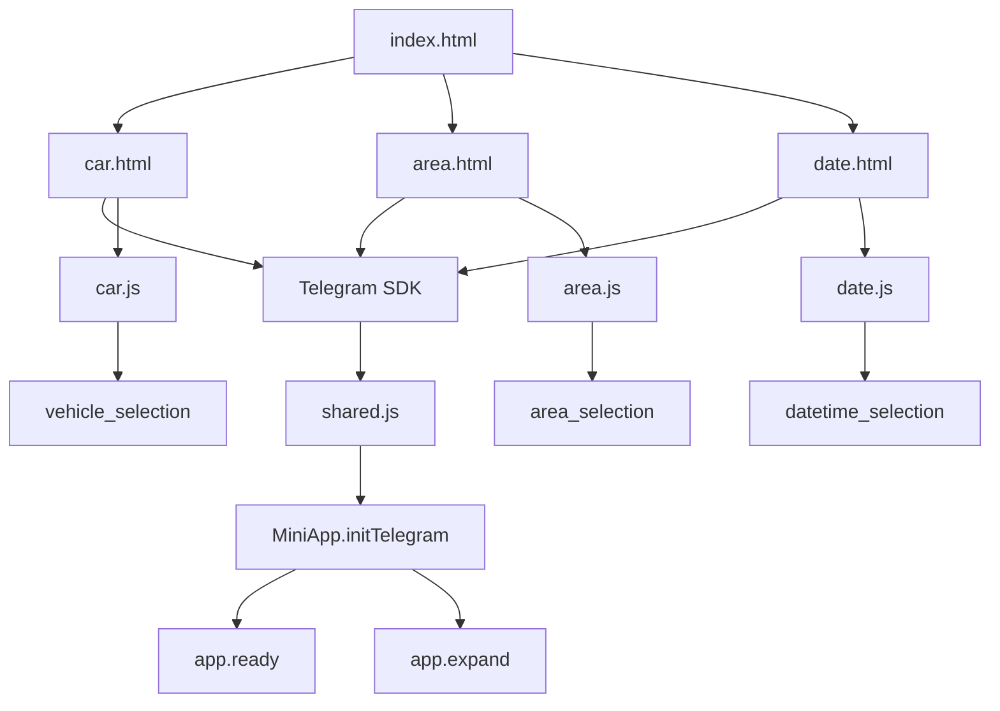

# Mini App Entry Flow

## Purpose

Show how the static entry page routes maintainers and testers to the selector pages, and where Telegram WebApp initialization starts.

## Notes / Constraints

- `index.html` is a static landing page with links to `car.html`, `area.html`, and `date.html`.
- `index.html` does not load the Telegram SDK and does not construct or submit payloads.
- `car.html`, `area.html`, and `date.html` load Telegram's SDK before deferred local scripts.
- Each selector page loads `shared.js` and then its page-specific script.
- Telegram initialization is centralized through `MiniApp.initTelegram()`.

## Source Of Truth

- `index.html`
- `car.html`
- `area.html`
- `date.html`
- `shared.js`
- `car.js`
- `area.js`
- `date.js`
