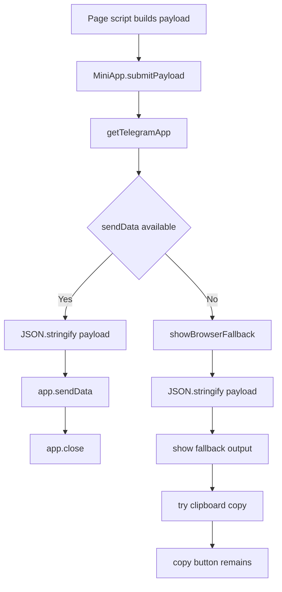

# Shared Submit Payload Flow

## Purpose

Show the shared transport path used by all selector pages after page-specific JavaScript builds a payload.

## Notes / Constraints

- `submitPayload(payload, fallbackElements)` does not decide payload fields. Page scripts do that before calling it.
- Inside Telegram, the payload is sent as `sendData(JSON.stringify(payload))`.
- After a Telegram send, `app.close?.()` is called when available.
- Outside Telegram, the same JSON is shown in the browser fallback and a clipboard copy is attempted.
- Browser fallback is for manual testing only. It is not Bot validation.

## Source Of Truth

- `shared.js`
- `car.js`
- `area.js`
- `date.js`
- `ride.js`
- `car.html`
- `area.html`
- `date.html`
- `ride.html`
