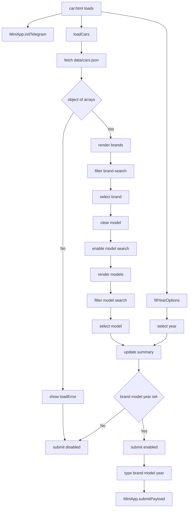

# Car Selection Page Flow

## Purpose

Show how `car.html` and `car.js` load car data, gate submission, and construct the current `vehicle_selection` payload.

## Notes / Constraints

- `data/cars.json` is fetched with `cache: "no-store"`.
- `validateCarData()` requires a top-level object whose values are arrays.
- Brand and model values are sorted with Arabic locale comparison.
- Year options are generated from the current local year down to `1980`.
- If a brand/model list contains `"Other"`, a non-empty search with no matches can expose `"Other"` as the fallback option.
- The submit button stays disabled until `brand`, `model`, and `year` are all set.
- The exact payload keys are `type`, `brand`, `model`, and `year`.
- The Mini App UI allowlist does not replace Bot-side validation.

## Source Of Truth

- `car.html`
- `car.js`
- `shared.js`
- `data/cars.json`
