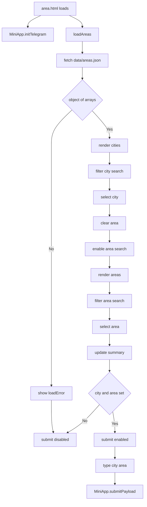

# Area Selection Page Flow

## Purpose

Show how `area.html` and `area.js` load area data, gate submission, and construct the current `area_selection` payload.

## Notes / Constraints

- `data/areas.json` is fetched with `cache: "no-store"`.
- `validateAreaData()` requires a top-level object whose values are arrays.
- Cities and areas are sorted with `Intl.Collator("ar", { numeric: true })`.
- Selecting a city clears the previous area and enables area search.
- Area selection does not have the car page's `"Other"` fallback.
- The submit button stays disabled until both `city` and `area` are set.
- The exact payload keys are `type`, `city`, and `area`.
- The Mini App UI allowlist does not replace Bot-side validation.

## Source Of Truth

- `area.html`
- `area.js`
- `shared.js`
- `data/areas.json`
