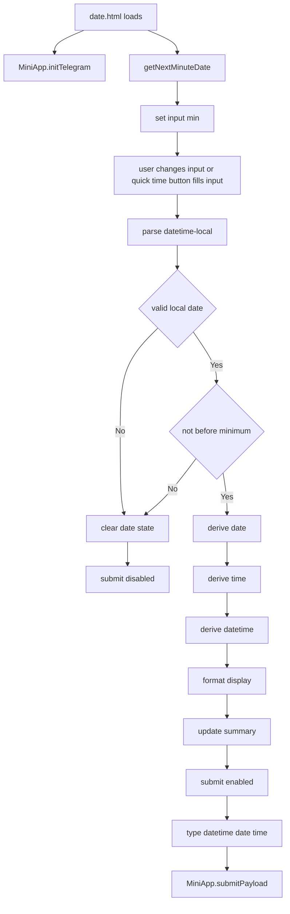

# Date Selection Page Flow

## Purpose

Show how `date.html` and `date.js` enforce the current future-only date/time selection and construct the `datetime_selection` payload.

## Notes / Constraints

- `dateTimeInput` uses `type="datetime-local"`.
- Quick time buttons fill the same `dateTimeInput` and then run the same validation/update path as manual input.
- Quick time buttons do not submit automatically.
- `minimumDateTime` is computed once at page load as the next local minute.
- The input `min` is set from that computed minimum.
- `parseDateTimeLocalValue()` accepts only `YYYY-MM-DDTHH:MM` and rejects rollover dates by comparing parsed parts.
- Values before `minimumDateTime` clear the state and keep submit disabled.
- Valid values derive `date` as `YYYY-MM-DD`, `time` as `HH:MM`, and `datetime` as `YYYY-MM-DD HH:MM`.
- The submit button stays disabled until `datetime` is set.
- The exact payload keys are `type`, `datetime`, `date`, and `time`.
- The Mini App future-only gate does not replace Bot-side validation.

## Source Of Truth

- `date.html`
- `date.js`
- `shared.js`
