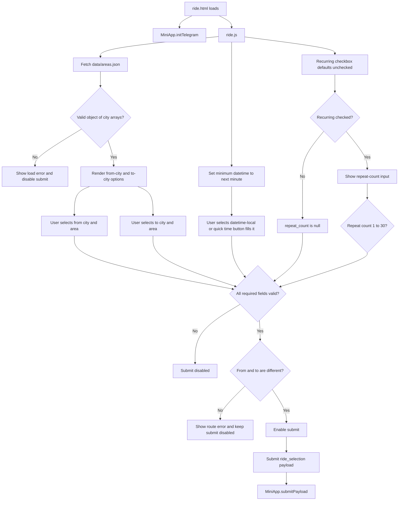

# Ride Selection Page Flow

## Purpose

Show how `ride.html` and `ride.js` collect a complete route, ride date/time, and optional daily recurrence before constructing the `ride_selection` payload.

## Notes / Constraints

- `ride.js` uses the same `data/areas.json` UI allowlist as `area.js`.
- Quick time buttons fill the same `dateTimeInput` and do not submit automatically.
- The page blocks identical from/to selections in the UI, but the Bot must still validate that rule.
- `is_recurring` is a boolean. `repeat_count` is `null` when normal, or a string from `"1"` to `"30"` when recurring.
- Arabic-Indic and Persian repeat-count digits are normalized before validation and payload submission.
- Recurrence means daily recurrence at the same selected time; `repeat_count` includes the first ride.
- `updateRideOptionDensity()` toggles `long-options` for both ride city and area lists when full candidate values exceed `longRideOptionLength`.

## Source Of Truth

- `ride.html`
- `ride.js`
- `shared.js`
- `style.css`
- `data/areas.json`
